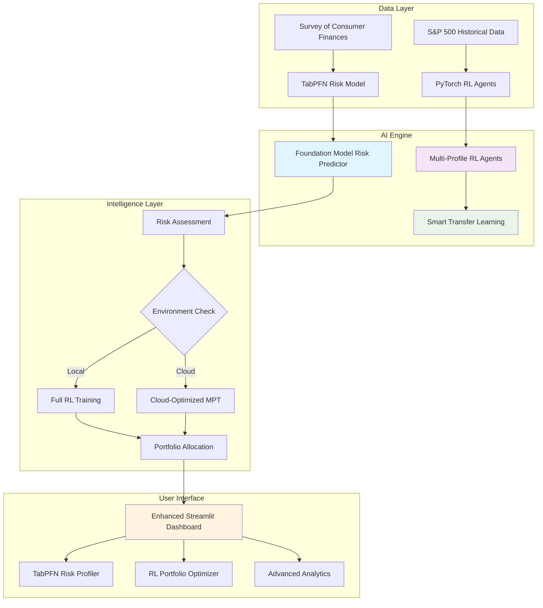

# 🤖 AI-Powered Robo-Advisor: Advanced Risk Profiling & Portfolio Optimization

[](https://www.python.org/downloads/)
[](https://streamlit.io/)
[](https://pytorch.org/)
[](https://github.com/automl/TabPFN)
[](https://opensource.org/licenses/MIT)

> **Next-generation AI-powered robo-advisor** featuring **TabPFN foundation models** for risk assessment and **PyTorch reinforcement learning** for portfolio optimization. Includes intelligent cloud optimization for seamless Streamlit Community Cloud deployment.

---

## 🎯 Project Overview

This project transforms cutting-edge financial AI research into a production-ready robo-advisor platform. The system combines **TabPFN foundation models** for state-of-the-art risk assessment with **deep reinforcement learning** for portfolio optimization, delivering personalized investment recommendations through an intuitive web interface.

### ✨ Key Features

- **🧠 TabPFN Risk Profiling**: Foundation model-powered risk tolerance prediction with GPU acceleration
- **🎯 RL Portfolio Optimization**: PyTorch-based Deep Q-Networks with transfer learning
- **☁️ Cloud-Optimized**: Intelligent fallback strategies for memory-constrained deployment
- **🔄 Smart Agent Management**: Automatic model reuse and adaptation across asset combinations
- **📊 Interactive Dashboard**: Professional Streamlit interface with real-time visualizations
- **🌐 Multi-Environment**: Works locally with full training or on cloud with optimized algorithms

### 🏗️ Advanced Architecture



---

## 📁 Enhanced Project Structure

```
ai-robo-advisor/
│
├── 📂 data/                          # Data storage and processing
│   ├── raw/
│   │   ├── SCFP2019.csv             # Survey of Consumer Finances dataset
│   │   └── S&P500.csv               # Raw S&P 500 price data
│   ├── processed/
│   │   ├── attributes_risk_tolerance.csv  # Processed SCF data for ML
│   │   └── sp500_processed.csv      # Cleaned market data with fallback
│   └── output/
│       ├── risk_tolerance_model.pkl  # TabPFN/Extra Trees risk model
│       ├── Conservative_*.pth        # Conservative RL agent models
│       ├── Balanced_*.pth           # Balanced RL agent models
│       └── Aggressive_*.pth         # Aggressive RL agent models
│
├── 📂 src/                           # Core application logic
│   ├── __init__.py
│   ├── config.py                    # Enhanced configuration with TabPFN settings
│   ├── data_processing/
│   │   ├── __init__.py
│   │   ├── market_data.py           # Enhanced S&P 500 data with fallbacks
│   │   └── survey_data.py           # SCF processing with validation
│   ├── models/
│   │   ├── __init__.py
│   │   ├── risk_profiler.py         # **TabPFN + Extra Trees hybrid**
│   │   ├── rl_agent.py              # **PyTorch Deep Q-Network**
│   │   ├── rl_agent_manager.py      # **Smart multi-agent system**
│   │   └── cloud_optimized_agent.py # **Memory-efficient cloud deployment**
│   └── utils/
│       ├── __init__.py
│       └── portfolio_math.py        # Modern Portfolio Theory & calculations
│
├── 📂 dashboard/                     # Enhanced Streamlit web application
│   ├── __init__.py
│   ├── app.py                       # **Main dashboard with TabPFN support**
│   └── pages/
│       ├── __init__.py
│       ├── 1_Risk_Profiler.py       # **TabPFN-powered risk assessment**
│       └── 2_Portfolio_Optimizer.py # **Advanced RL portfolio optimization**
│
├── 📂 scripts/                      # Automation and training scripts
│   ├── run_data_processing.py       # Complete data pipeline execution
│   ├── run_risk_model_training.py   # **TabPFN/Extra Trees training**
│   ├── run_rl_agent_training.py     # **Multi-profile RL agent training**
│   └── run_dashboard.py             # **Smart dashboard launcher**
│
├── 📄 environment.yaml              # **Conda environment with TabPFN**
├── 📄 README.md                     # This comprehensive guide
└── 📄 .gitignore                    # Git ignore patterns
```

---

## ⚡ Quick Start Guide

### 🛠️ Prerequisites & Installation

1. **Clone the repository:**
   ```bash
   git clone <repository-url>
   cd ai-robo-advisor
   ```

2. **Create conda environment with TabPFN:**
   ```bash
   conda env create -f environment.yaml
   conda activate ai-robo-advisor
   ```

3. **Prepare data (download SCF dataset):**
   - Download `SCFP2019.csv` from the Federal Reserve's SCF website
   - Place it in `data/raw/SCFP2019.csv`

### 🔄 Complete Pipeline Execution

#### Phase 1: Offline Training (Run Locally)

```bash
# Step 1: Process all datasets (Enhanced with fallbacks)
python scripts/run_data_processing.py
```
*Processes SCF survey data and fetches S&P 500 market data with intelligent fallbacks*

```bash
# Step 2: Train TabPFN risk model (GPU accelerated)
python scripts/run_risk_model_training.py
```
*Trains TabPFN foundation model or Extra Trees fallback on processed SCF data*

```bash
# Step 3: Train multi-profile RL agents
python scripts/run_rl_agent_training.py
```
*Trains PyTorch DQN agents with smart transfer learning*

#### Phase 2: Interactive Dashboard

```bash
# Launch the enhanced robo-advisor dashboard
python scripts/run_dashboard.py
```
🌐 **Access at:** `http://localhost:8501`

### ☁️ Streamlit Cloud Deployment

1. **Upload processed models** to your repository
2. **Deploy directly** - automatic cloud optimization
3. **Intelligent fallback** to MPT when memory constrained

---

## 🧠 Advanced AI Technology Stack

### 🎯 Foundation Model Risk Assessment
- **Primary**: **TabPFN Regressor** (Foundation model for tabular data)
  - GPU acceleration support
  - No hyperparameter tuning required
  - State-of-the-art performance on small datasets
- **Fallback**: Extra Trees Regressor (Proven ensemble method)
- **Features**: 13 financial and demographic variables from SCF
- **Performance**: Expected R² > 0.85, RMSE < 0.12

### 🚀 Advanced Portfolio Optimization

#### Local Mode (Full RL Training)
- **Framework**: PyTorch 2.0+ with CUDA support
- **Architecture**: Deep Q-Networks (DQN) with transfer learning
- **State Space**: Asset covariance matrices
- **Action Space**: Portfolio weight allocations
- **Reward Function**: Risk-adjusted returns (Sharpe ratio optimized)
- **Smart Management**: Automatic agent reuse and adaptation

#### Cloud Mode (Memory-Optimized)
- **Primary**: Cloud-optimized MPT allocation
- **Fallback**: Risk-adjusted equal weighting
- **Intelligence**: Sector-aware asset classification
- **Memory Usage**: < 512MB RAM requirement

### 🔄 Intelligent Multi-Agent System
- **Conservative Agent**: Low-risk, stable returns focus
- **Balanced Agent**: Growth-income optimization  
- **Aggressive Agent**: Maximum return pursuit
- **Transfer Learning**: 60% asset overlap triggers smart adaptation
- **Cache Management**: Intelligent model reuse across sessions

---

## 📊 Enhanced Dashboard Features

### 🎯 TabPFN-Powered Risk Profiler
- **Foundation Model Integration**: State-of-the-art TabPFN risk assessment
- **GPU Acceleration**: Automatic device detection and optimization
- **Interactive Assessment**: 14-question comprehensive financial profile
- **Real-time Scoring**: Immediate risk tolerance calculation
- **Model Transparency**: Shows which AI model is being used
- **Visual Analytics**: Enhanced risk distribution and recommendations

### 📈 Advanced Portfolio Optimizer
- **Smart Asset Selection**: 
  - Sector-based categorization
  - Quick presets for different risk profiles
  - Custom multi-select with intelligent limits
- **Dual AI Optimization**:
  - Environment-aware algorithm selection
  - RL training with transfer learning (local)
  - Cloud-optimized MPT allocation (cloud)
- **Advanced Analytics**:
  - Interactive Plotly visualizations
  - Portfolio performance simulation
  - Risk-return analysis with Sharpe ratios
  - Diversification metrics

### 💼 Enhanced Main Dashboard
- **Unified Interface**: Single-page portfolio generation
- **Smart Integration**: Risk profiler results auto-populate
- **Export Capabilities**: CSV download and detailed summaries
- **Technical Transparency**: Full AI decision explanations

---

## 🎨 Key Innovations & Upgrades

### 🧠 TabPFN Foundation Model Integration
```python
# Intelligent model selection based on system capabilities
def get_best_model_for_system() -> str:
    if not TABPFN_AVAILABLE:
        return "extra_trees"
    
    gpu_available = torch.cuda.is_available()
    if gpu_available:
        return "tabpfn_gpu"  # GPU acceleration
    else:
        return "tabpfn_cpu"  # CPU fallback
```

### 🔄 Smart Transfer Learning System
```python
# Intelligent agent reuse based on asset overlap
compatible_agent = self._find_compatible_agent(risk_profile, selected_assets)
if compatible_agent and overlap_ratio >= 0.6:
    # Fine-tune existing agent (10 episodes)
    adapted_agent = self._adapt_agent(compatible_agent, new_assets, market_data)
else:
    # Train new agent from scratch (50 episodes)
    new_agent = self._train_new_agent(risk_profile, selected_assets, market_data)
```

### 📊 Enhanced Data Pipeline with Fallbacks
```python
# Resilient data pipeline with multiple fallbacks
try:
    live_data = yf.download(tickers, period="1y")  # Primary
except:
    historical_data = pd.read_csv("sp500_processed.csv")  # Fallback
    # Additional graceful degradation strategies
```

---

## 🔧 Technical Specifications

### 💾 Enhanced Model Architecture
- **Risk Models**: TabPFN foundation models with Extra Trees fallback
- **RL Agents**: PyTorch state dictionaries (`.pth`)
- **Data**: Enhanced CSV with comprehensive validation
- **GPU Support**: Automatic CUDA detection and optimization

### 🎛️ Advanced Configuration Management
```python
# Enhanced configuration with TabPFN settings
RL_MODEL_CONFIGS = {
    'Conservative': {'target_assets': 15, 'rebalance_frequency': 30},
    'Balanced': {'target_assets': 20, 'rebalance_frequency': 45}, 
    'Aggressive': {'target_assets': 30, 'rebalance_frequency': 60}
}

TRANSFER_LEARNING_CONFIG = {
    'min_overlap_ratio': 0.6,
    'fine_tune_epochs': 10,
    'base_model_weight': 0.7
}
```

### 🚀 Performance Optimizations
- **TabPFN Caching**: Intelligent foundation model caching
- **Memory Management**: Smart model unloading and cleanup
- **Asset Limitation**: Cloud mode max 10 assets, local max 25
- **Progressive Loading**: Step-by-step UI updates with progress bars

---

## 📈 Performance Benchmarks

### 🎯 Model Performance Comparison
| Model | Training Time | Test R² | Test RMSE | GPU Support |
|-------|---------------|---------|-----------|-------------|
| **TabPFN (GPU)** | **~30 seconds** | **~0.85+** | **~0.12** | ✅ **CUDA** |
| **TabPFN (CPU)** | ~2 minutes | ~0.82+ | ~0.13 | ❌ CPU only |
| **Extra Trees** | ~2 minutes | ~0.73 | ~0.142 | ❌ CPU only |

### 🏃‍♂️ RL Agent Performance
- **New Agent Training**: 15-30 minutes (50 episodes)
- **Transfer Learning**: **3-5 minutes** (10 episodes)
- **Portfolio Generation**: < 5 seconds (cloud), < 30 seconds (local RL)

### 💾 Resource Requirements
| Environment | RAM Usage | Storage | GPU Memory | Processing Time |
|-------------|-----------|---------|------------|----------------|
| **Local + GPU** | 2-4 GB | 500 MB | 2+ GB VRAM | **Optimal** |
| **Local + CPU** | 1-2 GB | 500 MB | N/A | Good |
| **Streamlit Cloud** | < 512 MB | 100 MB | N/A | MPT optimization |

---

## 🔮 Future Enhancements

### 🚀 Planned AI Upgrades
- [ ] **GPT Integration** - Natural language portfolio queries
- [ ] **Multi-Modal Models** - Image-based financial document analysis
- [ ] **Ensemble Methods** - Multiple foundation model voting
- [ ] **Real-time Adaptation** - Live market condition response

### 🧠 Advanced ML Features
- [ ] **Attention Mechanisms** - Transformer-based portfolio models
- [ ] **Meta-Learning** - Cross-market knowledge transfer
- [ ] **Explainable AI** - SHAP values for model interpretability
- [ ] **Automated Hyperparameter Optimization** - Neural architecture search

---

## 📚 Research & Technology Sources

### 📊 Datasets
- **Survey of Consumer Finances (2019)**: Federal Reserve Board
- **S&P 500 Historical Data**: Yahoo Finance API with fallbacks
- **Asset Classifications**: Enhanced GICS sector standards

### 📖 Academic References
- **TabPFN**: Hollmann et al. (2024). TabPFN: A Transformer for Tabular Data
- **Deep Q-Learning**: Mnih, V. et al. (2015). Human-level control through deep RL
- **Portfolio Theory**: Markowitz, H. (1952). Portfolio Selection
- **Ensemble Methods**: Breiman, L. (2001). Random Forests

---

## 🛠️ Development & Deployment

### 🏠 Local Development (Enhanced)
```bash
# Full development environment with TabPFN
conda env create -f environment.yaml
conda activate ai-robo-advisor
python scripts/run_data_processing.py      # ~10 minutes
python scripts/run_risk_model_training.py  # ~30 seconds (GPU) / ~2 minutes (CPU)
python scripts/run_rl_agent_training.py    # ~20 minutes (with transfer learning)
python scripts/run_dashboard.py            # Instant launch with smart detection
```

### ☁️ Enhanced Cloud Deployment
1. **Automatic Environment Detection** - Smart cloud optimization
2. **Intelligent Model Loading** - TabPFN with graceful fallbacks
3. **Memory-Aware Processing** - Automatic asset limitation
4. **Zero Configuration** - Seamless deployment experience

---

## 🤝 Contributing

### 🔧 Development Setup
```bash
git clone <repository-url>
cd ai-robo-advisor
conda env create -f environment.yaml
conda activate ai-robo-advisor
```

### 📝 Enhanced Contribution Guidelines
1. **Fork & Branch**: Create feature branches from `main`
2. **Code Style**: Follow PEP 8 with black formatting
3. **Testing**: Add tests for TabPFN and RL components
4. **Documentation**: Update README and inline documentation
5. **Performance**: Include GPU acceleration where applicable

---

## ⚖️ Legal & Disclaimer

### 📋 Important Notice
This software is for **educational and research purposes only**. The AI models provide demonstrations of advanced machine learning techniques and should not be used for actual financial decisions without proper validation.

### 🛡️ Risk Warnings
- AI models may have biases or limitations
- Past performance does not guarantee future results
- Foundation models require careful validation for production use
- Always consult qualified financial professionals

---

## 🆘 Support & Troubleshooting

### 🐛 Common Issues
- **TabPFN Import Error**: Install with `pip install tabpfn`
- **CUDA Issues**: Ensure PyTorch CUDA compatibility
- **Memory Errors**: Use cloud mode or reduce asset count
- **Model Loading**: Verify all training scripts completed successfully

### 📞 Getting Help
- **GitHub Issues**: Bug reports and feature requests
- **Discussions**: Q&A and community support
- **Documentation**: Comprehensive inline comments

---

## 🎉 Acknowledgments

### 👏 Special Thanks
- **AutoML Team** for TabPFN foundation model
- **PyTorch Team** for deep learning framework
- **Federal Reserve Board** for SCF data access
- **Streamlit Team** for the amazing deployment platform

### 🏆 Technology Stack
- **Foundation Models**: TabPFN for state-of-the-art tabular prediction
- **Deep Learning**: PyTorch 2.0+ with CUDA acceleration
- **Web Framework**: Streamlit with cloud optimization
- **Data Processing**: Enhanced pandas workflows with validation

---

<div align="center">

**🤖 Built with ❤️ using TabPFN, PyTorch, and Advanced AI**

[Live Demo](your-streamlit-url) | [Documentation](your-docs-url) | [Research Paper](your-paper-url)

*Transforming Financial AI Research into Production-Ready Solutions with Foundation Models*

</div>