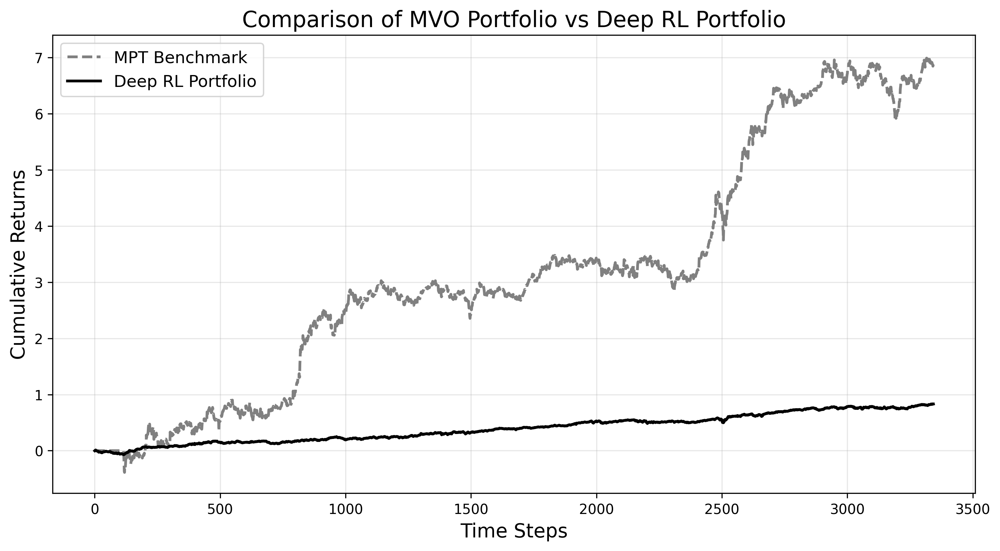
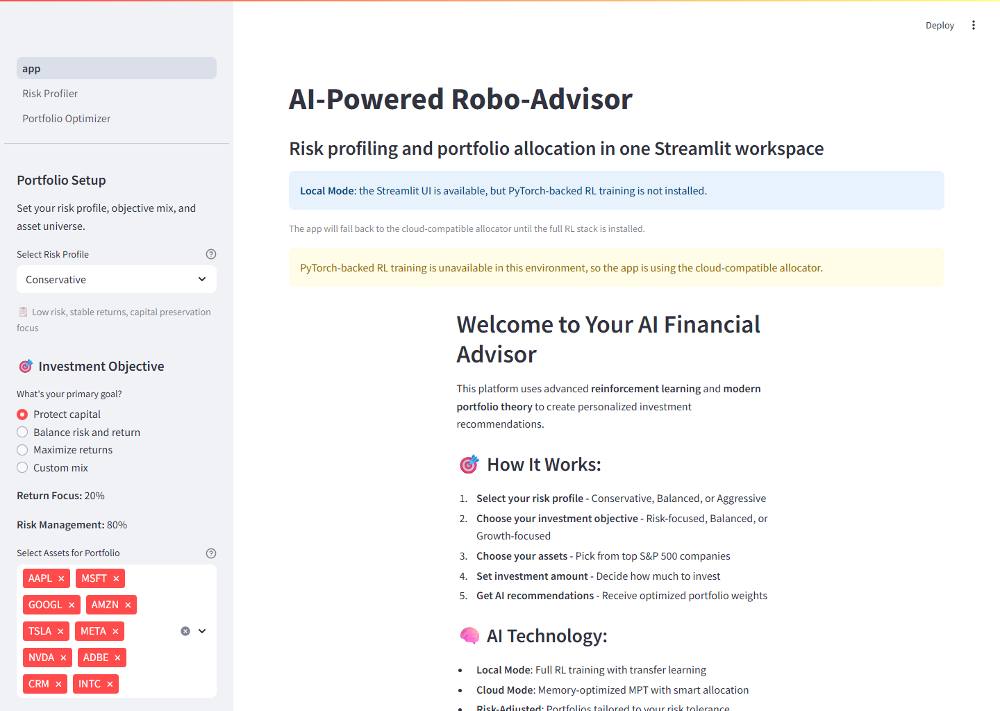

# AI-Powered Robo-Advisor: Advanced Risk Profiling & Portfolio Optimization

Build a Streamlit robo-advisor that trains a risk model from SCF data and uses S&P 500 market data to produce portfolio allocations.

It supports both full local training and cloud-aware fallback modes in the same UI.

<!-- README_SURFACE_START -->
  

[](https://adredes-weslee.github.io/ai/finance/foundation-models/reinforcement-learning/2025/06/24/robo-advisor-risk-profiling-portfolio-optimization.html) [](https://adredes-weslee-using-artificial-intelligenc-dashboardapp-juewyb.streamlit.app/)


## Quickstart

```bash
conda env create -f environment.yaml
python scripts/run_data_processing.py
python scripts/run_dashboard.py
```

See [Setup and Run](#setup-and-run) for the full environment and verification path.

<!-- README_SURFACE_END -->

## Interface Preview



The local demo now opens even without the full PyTorch training stack. When those heavier RL dependencies are unavailable, the dashboard falls back to the cloud-compatible allocation path so the Streamlit surface, saved models, and portfolio workflow can still be reviewed locally.

## Why This Repository Exists

- Turn survey-style inputs into a risk score and recommendation.
- Turn that risk output plus market context into a portfolio allocation.

## Architecture at a Glance

- `src/config.py` centralizes paths, filenames, the target column, asset universes, risk profiles, and cloud limits.
- `src/data_processing` builds `attributes_risk_tolerance.csv` and `sp500_processed.csv`; `src/models` trains the risk model and RL artifacts; `src/utils` provides mean-variance optimization and market-regime logic.
- `dashboard/app.py` is the main Streamlit app, with `dashboard/pages/1_Risk_Profiler.py` and `dashboard/pages/2_Portfolio_Optimizer.py` as the page flows; `scripts/run_dashboard.py` is the launcher.
- The repo includes saved outputs such as `data/output/risk_tolerance_model.pkl`, several `.pth` agents, and `evaluation_*.png` plots.

## Repository Layout

- `dashboard/`
- `data/`
- `notebooks/`
- `scripts/`
- `src/`
- `.gitignore`
- `environment.yaml`
- `README.md`
- `requirements.txt`

## Setup and Run

1. Use `environment.yaml` for the local conda environment and `requirements.txt` for the lean Streamlit Cloud-style install.
2. Follow the pipeline order: `python scripts/run_data_processing.py` -> `python scripts/run_risk_model_training.py` -> optional `python scripts/run_rl_agent_training.py` / `python scripts/train_objective_models.py` -> `python scripts/run_dashboard.py`.
3. `SCFP2019.csv` must be placed in `data/raw/`; `S&P500.csv` is optional because the market pipeline can fall back to Wikipedia and yfinance.
4. The launcher checks for processed SCF data, processed market data, and `risk_tolerance_model.pkl`; RL models are optional and can be trained on demand.

## Core Workflows

- SCF preprocessing selects a fixed feature set, computes `Risk_tolerance = Risky / (Risky + RiskFree)`, and clips or cleans invalid values.
- Market preprocessing scrapes tickers from Wikipedia, downloads prices with yfinance, and cleans missing data with filtering, interpolation, and fill.
- Risk profiling uses TabPFN when available, otherwise Extra Trees, but the dashboard can still fall back to heuristic scoring when model inference is unavailable.
- RL training and evaluation train a DQN agent against a CVXOPT MPT benchmark and save `evaluation_{profile}.png` plots.
- The portfolio page carries the risk result forward through `st.session_state`, then generates allocations, charts, and CSV downloads.

## Known Limitations

- Several AI paths are heuristic fallbacks rather than true model inference: the risk page uses heuristic scoring even when a model loads, the local dashboard calls `get_fallback_allocation` after agent creation, and the cloud manager returns a synthesized allocation instead of loading real weights.
- `train_objective_models.py` deletes every existing `*.pth` in `data/output/` before retraining the nine objective combinations, so it is destructive, not additive.
- No repo-local tests, CI, or `.streamlit/` deployment config are present in this snapshot.
- Cloud portfolio flow can generate synthetic prices when live and historical data are missing, which is fine for demo mode but not a substitute for real market data.
- `environment.yaml` pins CUDA PyTorch wheels, while `requirements.txt` is the lighter setup path.
